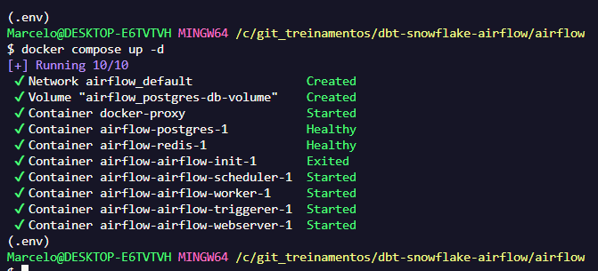
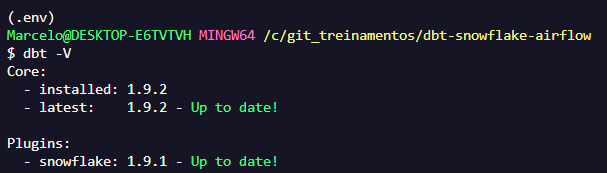
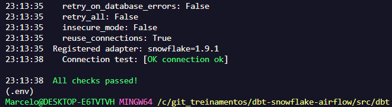
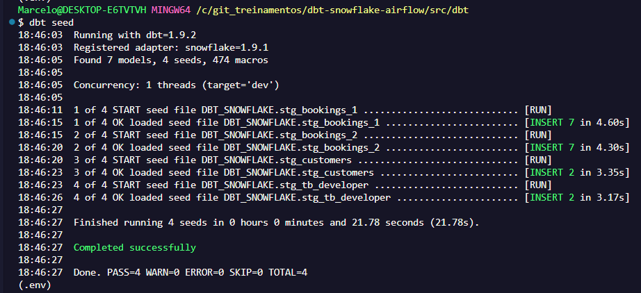
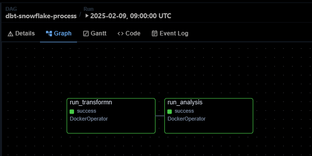
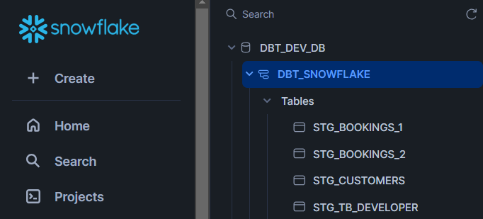
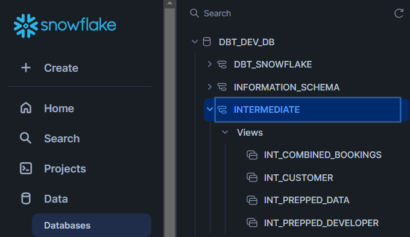
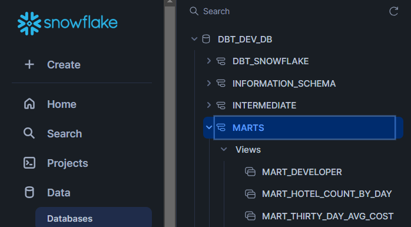
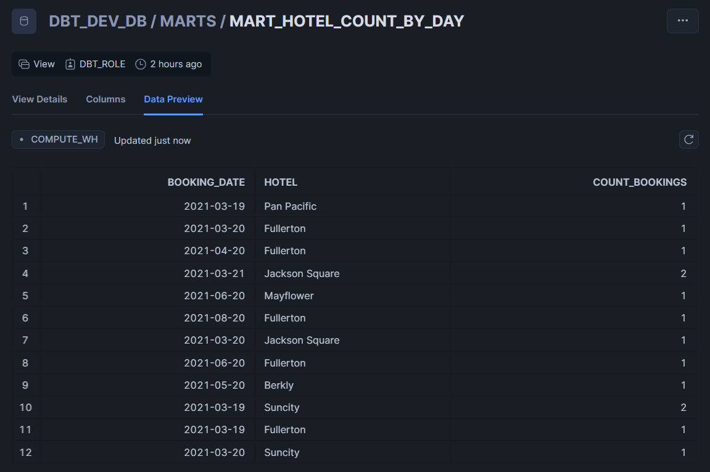

# Data Engineering with Apache Airflow, Snowflake and dbt
This project is based on the following Snowflake Guide for Data Engineering with Apache Airflow, Snowflake and dbt.

It is worth mentioning that this repo was created using the repo below as a base:
```
https://github.com/jacob-mennell/snowflakeAirflowDBT
```

## Step by step project:

Step 1: Create the Snowflake account

Step 2: Install Docker on windows with GitBash

Step 3: Conect dbt on Snowflake

Step 4: Ingest CSV files into Snowflake using dbt

Step 5: Criate a container imagem of dbt

Step 6: Run dbt container and conect on Snowflake with Airflow

## Follow the instructions below to complete all steps


## Arquiteture


## Introduction

### Snowflake

Snowflake is a Data Cloud platform solution, that provides an innovative and simplified data pipeline arquiteture, allowing you to focus more on data and analytics than infrastructure management.
It turns easy to storage, process and compute data when compared to traditional solutions.

### Airflow

Apache Airflow is an open source workflow management platform that allows you to efficiently create and manage data pipelines using directed acyclic graphs (DAGs) of tasks.

### Docker

Docker is used in this project to run Apache Airflow and later dbt in a container, making configuration and portability easier.

### dbt

DBT (Data Build Tool) is an open source command-line tool that allows data analysts and engineers to transform data in their data warehouse more efficiently. It follows a modular, versioned approach to data transformation, enabling teams to collaboratively build, maintain, and document data pipelines.

BBT simplifies the process of writing SQL code by organizing it into structured models and managing dependencies. It has gained popularity in modern data architectures, especially when integrated with cloud platforms like Snowflake.

The dbt CLI is a versatile command-line interface that makes managing dbt projects easy.

## Prior Requirements

This project requires the following steps:

* Docker

* Python >=3

* An snowflake account Snowflake.

* A Snowflake user with required permissions, including the ability to create objects in the DEMO_DB database.

### How to install Docker?
https://www.youtube.com/watch?v=pRFzDVn40rw&list=PLbPvnlmz6e_L_3Zw_fGtMcMY0eAOZnN-H

### How to create a Snowflake account?
https://www.snowflake.com/en/emea/

### How to create users and permission?
Access the folder ```scripts``` use the  ```dbt-snowflake-setup.sql``` as a base of it.

### How to clone the project?
Execute the command below:
```
git clone https://github.com/wlcamargo/dbt-snowflake-airflow.git
```
Access the folder project
```
cd dbt-snowflake-airflow
```
Run the Airflow container as below:
```
cd airflow
docker compose up -d
```
Expected result:




## How to access the Airflow?
Using the broswer of your wish type:
```
localhost:8081
```

---------------------------------------------

Airflow UI image:


---------------------------------------------

## Airlflow Credentials

username: airflow_pipe

password: airflow_pipe

---------------------------------------------

## How to install the dbt?
### Create a virtual environment
```
python3 -m venv .env
```

### Activate in (Linux)
```
source venv/bin/activate
```

### Activate in (Windows) by git bash
```
source .env/Scripts/activate
```

### Inside the virtual environment install dependencies from file
```
pip install -r requirements.txt
```

## How to verify DBT installation?
```
dbt --version
```

Expected result:




## How to configure DBT connection into Snowflake?
Access the folder ```src/dbt``` and use the file ```profiles.yml```

Change account settings ```account: your-account``` with Snowflake Credentials

To see if the procedure is right, use the command below:
```
cd src/dbt
dbt debug
```

Expected result:



## How to interact with DBT?
Use the  command below:
```
cd src/dbt
dbt seed
```

Expected result:



## How to create a DBT Docker image?
```
cd src
docker build -t dbt-snowflake .
```

## How to access DBT inside the container?
Type the code below:
```
docker run -it dbt-snowflake /bin/bash
```

## How to run a dag into Airflow?

The Dag is already created, just run it as below image:



## Snowflake Platform

### Tables ingested from CSV files in the input layer!


### Tables ingested in the middle layer!


### Tables ingested into the refined layer!


### Table Preview of one of process by dbt environment, it was created materialized views, as shown in the below example:



## Conclusion
If you are here, you finally got it! Congratulations that's your first project with DBT, Airflow and Snowflake all connected together!


## 📚 References

- [Repo usado como base](https://github.com/jacob-mennell/snowflakeAirflowDBT)

- [Exploring dbt with Snowflake](https://www.entechlog.com/blog/kafka/exploring-dbt-with-snowflake/)

- [Snowflake Guide: Data Engineering with Apache Airflow](https://quickstarts.snowflake.com/guide/data_engineering_with_apache_airflow/index.html)


## Big Data Engineer Developer
| Developer          | LinkedIn                                   | Email                        | GitHub                                 |
|--------------------|--------------------------------------------|------------------------------|----------------------------------------|
| Marcelo Peres    | [LinkedIn](https://www.linkedin.com/in/marcelo-peres-de/) | brmarcelo.peres@gmail.com        | [dbt-snowflake-airflow](https://github.com/Marcelo-Peres/dbt-snowflake-airflow)   |
