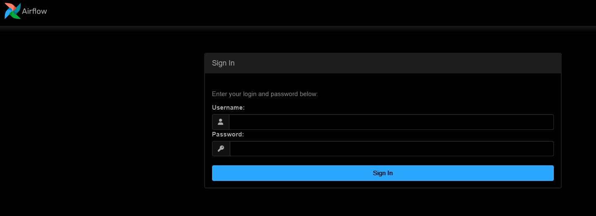

# Airflow:2.10 run into Docker

## Requirement
* Docker

## How to install Docker?
https://www.youtube.com/watch?v=pRFzDVn40rw&list=PLbPvnlmz6e_L_3Zw_fGtMcMY0eAOZnN-H

## How to install Airflow?
Please Clone the repo below:
```
git clone https://github.com/wlcamargo/airflow
```

Access the folder:
```
cd airflow
```

Run the container Images with the command below:
For linux:
```
sudo docker compose up -d
```
For Windows: << Docker Desktop needs to be installed >>
```
docker compose up -d
```

## How to access the Airflow?
localhost:8081

---------------------------------------------

Airflow UI example:



---------------------------------------------

## Credentials

username: airflow_pipe

password: airflow_pipe

---------------------------------------------

## Conclusion
Congrats! Airflow is running into Docker!

## 📚 References
https://airflow.apache.org/docs/apache-airflow/stable/installation/index.html

## Big Data Developer
| Big Data Developer | LinkedIn                                   | Email                        | Github                                 |
|--------------------|--------------------------------------------|------------------------------|----------------------------------------|
| Marcelo Peres      | [LinkedIn](https://www.linkedin.com/in/marcelo-peres-de/) | brmarcelo.peres@gmail.com        | [dbt-airflow-snowflake](https://github.com/Marcelo-Peres/dbt-snowflake-airflow/tree/main/airflow)   |
